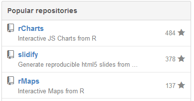

## d3Pie + rCharts

<!-- AddThis Smart Layers BEGIN -->
<!-- Go to http://www.addthis.com/get/smart-layers to customize -->
<script type="text/javascript" src="//s7.addthis.com/js/300/addthis_widget.js#pubid=ra-4fdfcfd4773d48d3"></script>
<script type="text/javascript">
  addthis.layers({
    'theme' : 'transparent',
    'share' : {
      'position' : 'left',
      'numPreferredServices' : 5
    }   
  });
</script>
<!-- AddThis Smart Layers END -->

```{r echo = F, warning =F, message=F, cache=FALSE}
knitr::opts_chunk$set(warning=F, error=F, message=F, fig.width = 10, fig.height = 6, results='asis', cache = F, tidy = F)

require(rCharts)
#turn off Rstudio viewer so each example can be seen
#doesn't really matter in Rmd that will be slidified
options(viewer = NULL) 
```

The design and visualization world loves to belittle pie charts.  However, there still exists a real demand for pie charts.  Me use a pie chart - oh no, but I was delighted to see the announcement of this very robust d3 pie library [`d3pie`](http://d3pie.org).  It is so beautiful and brilliantly designed that it tempted me to violate my self-imposed ban on pie charts.

### Get a rChart Shell for Our Delicious Pies

Eventually I would like to build a R `refClass` for [`d3pie`](http://d3pie.org), but for now I wanted to show how we could use [`d3pie`](http://d3pie.org) in R with [`rCharts`](http://rcharts.io).  Most of this should be considered experimental as I work through how best to support the [numerous options and features](http://d3pie.org/#docs) of [`d3pie`](http://d3pie.org).

```{r}
dPie <- rCharts$new()
dPie$setLib("http://timelyportfolio.github.io/rChartsExtra/d3pie")
#do once to add assets with slidify
cat(add_lib_assets(dPie$lib,cdn=T))
```

### Fill Our Pie | Simple Example

We have our crust, but I think we want more than just crust.  It is probably best to start simple with our filling.  Let's fill our pie of the star counts on Ramnath's most [popular Github repos](https://github.com/ramnathv).



A `data.frame` will be a good way to represent this data.  `d3pie` expects a `label` and `value`.

```{r}
starData <- data.frame(
  label = c("rCharts","slidify","rMaps"),
  value = c(484,318,137)
)
```

Now with our `starData` in proper format we can build a pie chart.  To keep it simple and understandable, we will just provide a title and data and let `d3pie` works its magic.

```{r "simpleexample"}
dPie$addParams(
  chartspec = list(
    header = list(
      title = list(
        text = "Star Count of Ramnath Repos"
      )
    )
    ,data = list(
      content = starData
    )
  )
)
dPie$params$dom = knitr:::opts_current$get("label")
dPie$print()
```

### Violate a Design Principle of rCharts

**Please note that these examples use a big hairy nested list which violates the author of rCharts Ramnath's design principles.**  However, this requires no extra code or refClasses, so these ugly nested lists are a nice way to experiment with d3pie.  In a little bit with our more advanced example, I think you will clearly understand why nested lists are not only ugly but also fairly unworkable.


### Fill Our Pie | Advanced Example

One complicated way to fill our pie is to recreate the [d3pie example](http://d3pie.org/#generator-start) and even get the exact JSON from the example with `fromJSON`.  This will most likely not be the way a R user would populate the options and data of a d3pie, but seeing this method might help us better understand the rCharts binding.

```{r}
#clear out our chartspec
dPie$params$chartspec <- NULL
#JSON copied from the d3pie example
dPie$addParams(chartspec = rjson::fromJSON('{  
"header": {
  "title": {
    "text": "Lots of Programming Languages",
    "fontSize": 24,
    "font": "open sans"
  },
  "subtitle": {
    "text": "A full pie chart to show off label collision detection and resolution.",
    "color": "#999999",
    "fontSize": 12,
    "font": "open sans"
  },
  "titleSubtitlePadding": 9
},
"footer": {
  "color": "#999999",
  "fontSize": 10,
  "font": "open sans",
  "location": "bottom-left"
},
"size": {
  "canvasWidth": 590
},
"labels": {
  "outer": {
    "pieDistance": 32
  },
  "inner": {
    "hideWhenLessThanPercentage": 3
  },
  "mainLabel": {
    "fontSize": 11
  },
  "percentage": {
    "color": "#ffffff",
    "decimalPlaces": 0
  },
  "value": {
    "color": "#adadad",
    "fontSize": 11
  },
  "lines": {
    "enabled": true
  }
},
"effects": {
  "pullOutSegmentOnClick": {
    "effect": "linear",
    "speed": 400,
    "size": 8
  }
},
"misc": {
  "gradient": {
    "enabled": true,
    "percentage": 100
  }
}
}'
))
```

### Serious Violation of No Nested List Design Principle

As discussed above, **please note that these examples use a big hairy nested list which violates the author of rCharts Ramnath's design principles.**  One look at this one, and you will probably quickly understand why Ramnath avoids them.

```{r}
cat(
  paste0(
    capture.output(
      Hmisc:::list.tree(
        dPie$params$chartspec
        ,maxlen=40
      )
    )
    ,separator="<br>"
  )
)
```

### Just a List | Change the Title

One of the nice features of d3pie is the ability to provide a title and subtitle in the chart spec.  To highlight this feature and also prove that we are just working with R `lists`, let's change the title.

```{r}
#as a simple example let's change the header title
dPie$params$chartspec$header$title = list(
  text = "d3Pie Example Recreated in R with rCharts",
  fontsize = 20,
  font = "open sans"
)
cat(
  paste0(
    capture.output(
      Hmisc:::list.tree(
        dPie$params$chartspec$header$title
        ,maxlen=40
      )
    )
    ,separator="<br>"
  )
)
```

### JSON -> List -> data.frame

We now need to get the data from the example.  I am guessing that this is the best test of your R skills.  The simple explanation of the process is


 - get the JSON array of objects `[{},{},...]` as a R list
 - make each list item a data.frame
 - then combine all the data.frame rows into one data.frame.
 
```{r}
#make the data content list a data.frame and try it out
#data.frame will be the most likely data source
#use rCharts to_json to convert data.frame into expected d3pie format
#if desired and probable in future, build a refClass for d3pie
#to_json(dPie$params$chartspec$data$content,orient="records")
data <- do.call(
  rbind,
  lapply(
    rjson::fromJSON('[
{
  "label": "JavaScript",
  "value": 264131,
  "color": "#2484c1"
},
{
  "label": "Ruby",
  "value": 218812,
  "color": "#0c6197"
},
{
  "label": "Java",
  "value": 157618,
  "color": "#4daa4b"
},
{
  "label": "PHP",
  "value": 114384,
  "color": "#90c469"
},
{
  "label": "Python",
  "value": 95002,
  "color": "#daca61"
},
{
  "label": "C+",
  "value": 78327,
  "color": "#e4a14b"
},
{
  "label": "C",
  "value": 67706,
  "color": "#e98125"
},
{
  "label": "Objective-C",
  "value": 36344,
  "color": "#cb2121"
},
{
  "label": "Shell",
  "value": 28561,
  "color": "#830909"
},
{
  "label": "Cobol",
  "value": 24131,
  "color": "#923e99"
},
{
  "label": "C#",
  "value": 100,
  "color": "#ae83d5"
},
{
  "label": "Coldfusion",
  "value": 68,
  "color": "#bf273e"
},
{
  "label": "Fortran",
  "value": 218812,
  "color": "#ce2aeb"
},
{
  "label": "Coffeescript",
  "value": 157618,
  "color": "#bca44a"
},
{
  "label": "Node",
  "value": 114384,
  "color": "#618d1b"
},
{
  "label": "Basic",
  "value": 95002,
  "color": "#1ee67b"
},
{
  "label": "Cola",
  "value": 36344,
  "color": "#b0ec44"
},
{
  "label": "Perl",
  "value": 32170,
  "color": "#a4a0c9"
},
{
  "label": "Dart",
  "value": 28561,
  "color": "#322849"
},
{
  "label": "Go",
  "value": 264131,
  "color": "#86f71a"
},
{
  "label": "Groovy",
  "value": 218812,
  "color": "#d1c87f"
},
{
  "label": "Processing",
  "value": 157618,
  "color": "#7d9058"
},
{
  "label": "Smalltalk",
  "value": 114384,
  "color": "#44b9b0"
},
{
  "label": "Scala",
  "value": 95002,
  "color": "#7c37c0"
},
{
  "label": "Visual Basic",
  "value": 78327,
  "color": "#cc9fb1"
},
{
  "label": "Scheme",
  "value": 67706,
  "color": "#e65414"
},
{
  "label": "Rust",
  "value": 36344,
  "color": "#8b6834"
},
{
  "label": "FoxPro",
  "value": 32170,
  "color": "#248838"
}
]'),
    data.frame
  )
)
```

Finish our re-creation of the example by supplying our data to our pie.

```{r "example1"}
#now that we have data as a data.frame which a R user should know well
#show how to specify a data.frame as our data.source
dPie$addParams(chartspec = list(
  data = list(
    sortOrder = "value-desc",
    content = data
  )
))
dPie$params$dom = knitr:::opts_current$get("label")
dPie$print()
```

### Great Defaults of d3Pie

I want to stress once again how powerful and well-designed `d3pie` is.  It offers great defaults, solid feautures and behaviors, and easy customization.  Let's delete the `color` from our data to see the standard set of `d3pie` colors.

```{r "example2"}
#now show how d3Pie responds if no color
#hard to tell but the colors are different
dPie$params$chartspec$data <- list(
    sortOrder = "value-desc",
    content = data[,-3]  #-3 means exclude the color column
)

dPie$params$dom = knitr:::opts_current$get("label")
dPie$print()
```

### Colors from R

`rCharts` is designed to cater to the R user and assumes no user knowledge of Javascript.  R has lots of color palettes.  We'll use R's `topo.json` palette to configure our pie chart.

```{r "example3"}
#now change so that the color is calculated in R
#?topo.colors
dPie$params$chartspec$data$content <- data.frame(
    data[order(data$value,decreasing=T),-3],  #data w/o the color column
    color = substr(topo.colors(nrow(data)),0,7) #R topo.colors
)
dPie$params$dom = knitr:::opts_current$get("label")
dPie$print()
```

### R Sort

You might notice that the colors don't look right.  The reason why is that Scala, Smalltalk, and PHP have the same values.  Just like we did with the colors, we can let R do the sorting for us.

```{r "example4"}
#sort from d3pie is slightly different so let R sort
#since values for smalltalk = node = php
dPie$params$chartspec$data$sortOrder <- NULL
dPie$params$dom = knitr:::opts_current$get("label")
dPie$print()
```
